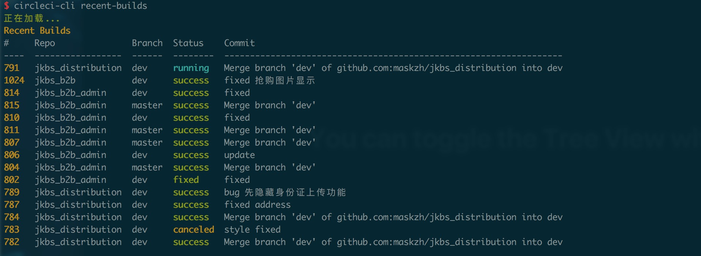

# circle-cli [](https://www.npmjs.org/package/circle-cli)

A CircleCI CLI via node

## Install
```shell
npm i circle-cli -g
```

## Configuration
```shell
export CIRCLE_TOKEN='your circleci token'
export CIRCLE_VCS_TYPE='github'
export CIRCLE_USERNAME='maskzh'
```
add these to `.bashrc` or `.zshrc`

## Usage
```
circle-cli ls # 最近 build 记录

circle-cli projects # 列出项目
circle-cli projects -v # 列出项目及分支

circle-cli show      # 最近一条 build 记录的构建详情
circle-cli artifacts # 最近一条 build 记录的 artifacts
circle-cli cancel    # 取消最近一条 build
circle-cli retry     # rebuild 最近一条 build

circle-cli project -p reponame           # reponame 的 build 记录
circle-cli project -p reponame -n 199    # reponame 序号为 199 的 build 详情
circle-cli project -p reponame -n 199 -a # reponame 序号为 199 的 artifacts
circle-cli project -p reponame -n 199 -c # 取消 reponame 序号为 199 的 build
circle-cli project -p reponame -n 199 -r # rebuild reponame 序号为 199 的 build
```

## Preview

