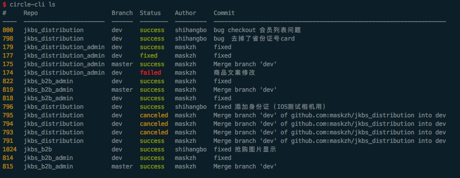

# circle-cli [](https://www.npmjs.org/package/circle-cli)

## Install
```shell
npm i circle-cli -g
```

## Usage
```shell
export CIRCLE_TOKEN='xxx'
export CIRCLE_VCS_TYPE='github'
export CIRCLE_USERNAME='maskzh'
```
add to `.bashrc` or `.zshrc`

then

```
circle-cli ls
```

## Preview

